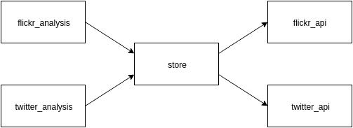

Usage
=====

The main structure of SocialWeatherGuage looks like this:

That is, if you want to run an analysis and get some diagram drawn, you have to work with functions in either ``main.flickr_analysis`` or ``main.twitter_analysis``. They get the data from ``main.store``, which either downloads new data or retrieves it from the cache on disc (folder ``store_room``). If the ``main.store`` needs new data, it uses either ``apis.flickr_api`` or ``apis.twitter_api`` to access the apis of Twitter and Flickr.  

Example
-------

As an example, let us draw a diagram 

.. image:: ../img/flickr_flooding_switzerland.png

